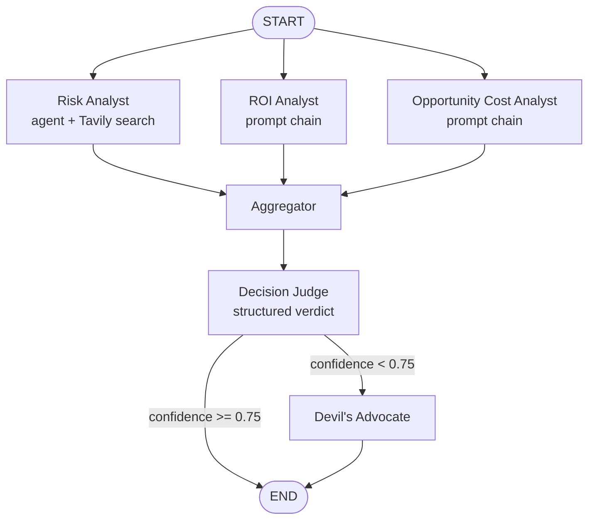

<div align="center">

# ⚖️ VerdictFlow AI

### Agentic Decision Intelligence Workflow

*Put every decision on trial — risk, return, and opportunity cost, argued out by a council of AI analysts and ruled on by an AI judge.*

[](LICENSE)
[](https://www.python.org/)
[](https://github.com/langchain-ai/langgraph)
[](https://github.com/langchain-ai/langchain)
[](https://colab.research.google.com/github/moonmido/VerdictFlow-AI-Agentic-Decision-Intelligence-Workflow/blob/main/VerdictFlow_AI.ipynb)

</div>

---

## Table of Contents

- [Overview](#overview)
- [At a Glance](#at-a-glance)
- [How It Works](#how-it-works)
  - [The Council (Parallel Analysis)](#the-council-parallel-analysis)
  - [The Judge](#the-judge)
  - [The Devil's Advocate](#the-devils-advocate)
- [Key Features](#key-features)
- [Tech Stack](#tech-stack)
- [Project Structure](#project-structure)
- [Getting Started](#getting-started)
  - [Prerequisites](#prerequisites)
  - [Installation](#installation)
  - [Configuration](#configuration)
  - [Running VerdictFlow](#running-verdictflow)
- [Usage](#usage)
  - [Sample Results](#sample-results)
- [Understanding the Output](#understanding-the-output)
- [Evaluation and Observability](#evaluation-and-observability)
- [Ideas for Extension](#ideas-for-extension)
- [Disclaimer](#disclaimer)
- [Contributing](#contributing)
- [License](#license)
- [Acknowledgments](#acknowledgments)

---

## Overview

**VerdictFlow AI** is an agentic decision-intelligence workflow, built on [LangGraph](https://github.com/langchain-ai/langgraph), that evaluates a single decision statement — a business call, a career move, a resourcing trade-off — the way a small advisory panel would: by putting it in front of several independent specialists, forcing a judge to weigh their findings, and, when the judge isn't confident, calling in a devil's advocate to argue the other side before the verdict is final.

Rather than asking one LLM to reason about risk, return, and trade-offs all at once, VerdictFlow decomposes the decision into three independent analyses that run **in parallel**, fans them back into a single view, and hands that to a dedicated **Decision Judge** model that returns a structured, machine-readable verdict — `ACCEPT` or `REJECT` — along with a confidence score and its reasoning.

## At a Glance

| | |
|---|---|
| **Input** | A single natural-language decision statement |
| **Output** | `verdict` (`ACCEPT`/`REJECT`), `confidence` (0–1), `reasoning`, plus the full intermediate state |
| **Orchestration** | LangGraph `StateGraph` — 3-way parallel fan-out → aggregate → judge → conditional branch |
| **LLM** | `openai/gpt-oss-20b`, served via NVIDIA NIM, `temperature=0` |
| **External tool** | Tavily web search (Risk Analyst only) |
| **Observability** | LangSmith tracing + batch evaluation |

## How It Works



All five LLM-driven components share a **single `ChatNVIDIA` client** — they're differentiated entirely by system prompt/template, not by different models, which keeps behavior consistent and reasoning traceable across the whole run.

### The Council (Parallel Analysis)

Three components analyze the same decision simultaneously, each deliberately restricted to its own lens so its judgment isn't diluted by the others:

| Node | Type | Lens | Tools | Returns |
|---|---|---|---|---|
| `risk_analysis` | Tool-using agent (`create_agent`) | Short/long-term/hidden risk, probability of failure, worst realistic outcome | Tavily web search | Risk level (LOW/MEDIUM/HIGH), probability of failure, top risk, evidence |
| `roi_analysis` | Prompt → LLM chain | Time, effort, and resources required vs. expected return | — | ROI score (0–100), expected return, investment required |
| `opportunity_cost_analysis` | Prompt → LLM chain | What's sacrificed, best alternative, cost of delay | — | Opportunity cost level (LOW/MEDIUM/HIGH), best alternative, main sacrifice |

Only the Risk Analyst is wired up with a real tool. It's the one lens where grounding in current, real-world information — recent failures, market conditions, regulatory shifts — matters more than closed-form reasoning does.

A plain, LLM-free `aggregator` node then concatenates the three analyses into a single text block once all three finish, so the judge sees the complete picture in one prompt.

### The Judge

The `decision_judge` node calls the LLM with `.with_structured_output()` against a Pydantic schema, forcing a clean, parseable result:

```python
class JudgeOutput(BaseModel):
    verdict: Literal["ACCEPT", "REJECT"]
    confidence: float  # 0.0 – 1.0
    reasoning: str
```

The judge's prompt explicitly instructs it not to blindly trust any single analyst, to weigh severe or highly probable risks more heavily than raw ROI, and to let a low opportunity cost strengthen an otherwise marginal case.

### The Devil's Advocate

If `confidence >= 0.75`, the run ends immediately. If not, LangGraph routes the state to a `devils_advocate` node — an adversarial chain instructed to attack the verdict, surface its weakest assumption, point out missing evidence, and argue the opposite conclusion.

Its critique is written to `state["devils_advocate"]` for the caller to inspect. In the current graph, this branch flows straight to `END` afterward — the critique is surfaced as additional signal but doesn't yet trigger an automatic re-judgment (see [Ideas for Extension](#ideas-for-extension)).

## Key Features

- 🧠 **Multi-agent council** — three independent analyst personas evaluate the same decision in parallel, each constrained to its own lens.
- 🔎 **Grounded risk analysis** — the Risk Analyst is a real tool-using agent with live Tavily search, so it can pull in current market conditions and real-world failure cases instead of relying purely on parametric knowledge.
- ⚖️ **Structured, holistic judgment** — a single Decision Judge synthesizes all three analyses into one machine-readable verdict, confidence score, and rationale via Pydantic-enforced structured output.
- 🥊 **Adversarial self-check** — low-confidence verdicts automatically get challenged by a Devil's Advocate agent before the run ends, adding a red-team layer to weaker calls.
- 🔀 **Parallel fan-out / fan-in graph** — built on LangGraph's `StateGraph`, running the three analysts concurrently rather than sequentially.
- 📊 **Built-in evaluation harness** — wired directly into LangSmith for full run tracing and batch evaluation against a labeled dataset.

## Tech Stack

- **Orchestration:** [LangGraph](https://github.com/langchain-ai/langgraph) — `StateGraph`, parallel fan-out/fan-in, conditional edges
- **Agent / LLM framework:** [LangChain](https://github.com/langchain-ai/langchain) — `create_agent`, prompt templates, structured output
- **LLM provider:** [NVIDIA NIM / API Catalog](https://build.nvidia.com/) via `langchain-nvidia-ai-endpoints` — model: `openai/gpt-oss-20b`
- **Web search tool:** [Tavily](https://tavily.com/) via `langchain-tavily`
- **Structured output validation:** [Pydantic](https://github.com/pydantic/pydantic)
- **Observability & evaluation:** [LangSmith](https://smith.langchain.com/)
- **Runtime:** Jupyter notebook (authored in Google Colab)

## Project Structure

```
VerdictFlow-AI-Agentic-Decision-Intelligence-Workflow/
├── VerdictFlow_AI.ipynb                        # Main notebook: agents, graph, evaluation
├── langsmith-evaluation-test-result/
│   └── decision-council-v1-7d1b1e08.csv        # Sample LangSmith evaluation export
├── LICENSE                                     # MIT License
└── README.md
```

## Getting Started

### Prerequisites

- Python 3.10+ (the original notebook was run on Python 3.12 via Google Colab)
- A Jupyter environment — Google Colab (one click via the badge at the top) or a local Jupyter/JupyterLab install
- API keys for the three external services the workflow calls:

| Service | Used for | Get a key |
|---|---|---|
| [NVIDIA API Catalog](https://build.nvidia.com/) | Hosts the `openai/gpt-oss-20b` model powering every agent/chain | build.nvidia.com |
| [Tavily](https://tavily.com/) | Web search tool used by the Risk Analyst | tavily.com |
| [LangSmith](https://smith.langchain.com/) | Tracing every run, plus the batch-evaluation cell at the end of the notebook | smith.langchain.com |

> [!NOTE]
> LangSmith is optional if you only want to run the graph interactively — you can set `LANGSMITH_TRACING` to `"false"` or skip that block. It's required for the final evaluation cell, which also expects a LangSmith dataset named `decision-council-dataset` to already exist in your workspace.

### Installation

```bash
git clone https://github.com/moonmido/VerdictFlow-AI-Agentic-Decision-Intelligence-Workflow.git
cd VerdictFlow-AI-Agentic-Decision-Intelligence-Workflow
pip install langchain langgraph langchain-nvidia-ai-endpoints langchain-tavily langsmith
```

<details>
<summary>Pinned versions used in the original run (optional, for reproducibility)</summary>

| Package | Version |
|---|---|
| `langchain` | 1.3.11 |
| `langgraph` | 1.2.6 |
| `langchain-nvidia-ai-endpoints` | 1.4.3 |
| `langchain-tavily` | 0.2.18 |

</details>

### Configuration

Set the following environment variables before running the notebook (the first code cell sets them inline — swap in your own keys, or export them beforehand and clear the hard-coded values):

```python
import os

os.environ["LANGSMITH_TRACING"]  = "true"
os.environ["LANGSMITH_ENDPOINT"] = "https://api.smith.langchain.com"
os.environ["LANGSMITH_API_KEY"]  = "..."
os.environ["LANGSMITH_PROJECT"]  = "..."
os.environ["TAVILY_API_KEY"]     = "..."
os.environ["NVIDIA_API_KEY"]     = "..."
```

> [!TIP]
> Don't commit real keys. In Colab, use the Secrets (🔑) panel instead of hard-coding them into a cell; locally, load them from a `.env` file with `python-dotenv` and keep that file out of version control.

### Running VerdictFlow

1. Open [`VerdictFlow_AI.ipynb`](VerdictFlow_AI.ipynb) in Colab or Jupyter.
2. Run the cells top to bottom — this installs dependencies, defines the analyst chains/agents, builds the `State` schema, wires up the `StateGraph`, and compiles it into `workflow`.
3. Call `workflow.invoke(...)` with your own decision (see [Usage](#usage)).

## Usage

```python
result = workflow.invoke({
    "decision": "Should we raise a Series A now, or wait 6 more months to grow revenue?"
})

print(result["verdict"])      # "ACCEPT" or "REJECT"
print(result["confidence"])   # 0.0 – 1.0
print(result["reasoning"])    # the judge's explanation

# Populated only when confidence < 0.75:
print(result.get("devils_advocate"))
```

### Sample Results

Pulled directly from the sample LangSmith evaluation export included in this repo (`langsmith-evaluation-test-result/decision-council-v1-7d1b1e08.csv`):

| Decision | Verdict | Confidence | Devil's Advocate invoked? |
|---|---|---|---|
| Should a software company replace its current customer support workflow with AI agents within the next month? | REJECT | 0.68 | Yes |
| Should I leave university this year to work full-time on my early-stage software startup? | REJECT | 0.78 | No |
| Should I stop learning AI agents and focus entirely on Kubernetes for the next three months? | REJECT | 0.68 | Yes |
| Should a small startup invest most of its available budget into building an AI product before validating customer demand? | REJECT | 0.92 | No |

*("Devil's Advocate invoked?" is derived from the `confidence >= 0.75` rule in `route_decision`, not a literal column in the CSV.)*

## Understanding the Output

`workflow.invoke(...)` returns the full `State`, a `TypedDict` with the following fields:

| Field | Type | Description |
|---|---|---|
| `decision` | `str` | The decision statement supplied by the caller |
| `risk_analysis` | `str` | Output of the Risk Analyst agent |
| `roi_analysis` | `str` | Output of the ROI Analyst chain |
| `opportunity_cost` | `str` | Output of the Opportunity Cost Analyst chain |
| `aggregated_analysis` | `str` | The three analyses concatenated into one block |
| `verdict` | `"ACCEPT"` \| `"REJECT"` | Final call from the Decision Judge |
| `confidence` | `float` (0–1) | Judge's confidence in the verdict |
| `reasoning` | `str` | Judge's explanation for the verdict |
| `devils_advocate` | `str` | Adversarial critique — only populated when `confidence < 0.75` |

## Evaluation and Observability

Every invocation is traced end-to-end in LangSmith once `LANGSMITH_TRACING` is enabled, so you can inspect each analyst's prompt/response, the tool calls made by the Risk Analyst, and the judge's structured output for any given run.

The final notebook cell runs a batch evaluation with the LangSmith SDK:

```python
from langsmith import Client

client = Client()

experiment_results = client.evaluate(
    target,
    data="decision-council-dataset",
    experiment_prefix="decision-council-v1",
)
```

`target()` wraps `workflow.invoke()` and returns just `verdict`, `confidence`, and `reasoning` for scoring.

> [!NOTE]
> This expects a dataset named `decision-council-dataset` to already exist in your LangSmith project. Create one (a set of `{"decision": "..."}` examples) in the LangSmith UI or SDK before running this cell.

`langsmith-evaluation-test-result/decision-council-v1-7d1b1e08.csv` is a sample export from one such run: 4 example decisions, all completed successfully, with per-run latency of roughly **31–39 seconds** and token usage ranging from about **28K to 136K tokens** — driven largely by how many Tavily searches the Risk Analyst issued for a given decision.

## Ideas for Extension

Not implemented — just gaps a contributor might want to close:

- [ ] Loop the Devil's Advocate critique back into the Decision Judge for a revised verdict, instead of ending the run right after the challenge.
- [ ] Give the ROI and Opportunity Cost analysts tool access (e.g., Tavily) for evidence-backed estimates, matching the Risk Analyst.
- [ ] Wrap `workflow.invoke()` in a small CLI or FastAPI endpoint so VerdictFlow can be called outside the notebook.
- [ ] Persist run history (decision, verdict, reasoning) for longitudinal tracking of decision outcomes.
- [ ] Script the creation of the `decision-council-dataset` LangSmith dataset so the evaluation cell works out of the box for new users.

## Disclaimer

VerdictFlow AI is a demonstration of an agentic decision-support pattern, not a source of financial, legal, or professional advice. Every verdict is generated by LLMs reasoning over LLM-generated sub-analyses (plus whatever Tavily's search happens to surface that day) — treat the verdict, confidence score, and reasoning as one structured input into your own judgment, not a replacement for it, especially for high-stakes decisions.

## Contributing

Issues and pull requests are welcome. [Ideas for Extension](#ideas-for-extension) above is a good place to start. For larger changes, please open an issue first to discuss what you'd like to change.

## License

Distributed under the MIT License — see [`LICENSE`](LICENSE) for the full text.

Copyright (c) 2026 Boutmedjet Abd elmoudjib

## Acknowledgments

Built with:

- [LangChain](https://github.com/langchain-ai/langchain) & [LangGraph](https://github.com/langchain-ai/langgraph) — agent framework and graph orchestration
- [NVIDIA NIM / API Catalog](https://build.nvidia.com/) — hosted inference for `openai/gpt-oss-20b`
- [Tavily](https://tavily.com/) — real-time web search tool
- [LangSmith](https://smith.langchain.com/) — tracing and evaluation

---

<div align="center">

Maintained by [@moonmido](https://github.com/moonmido)

</div>
